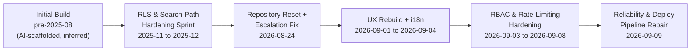
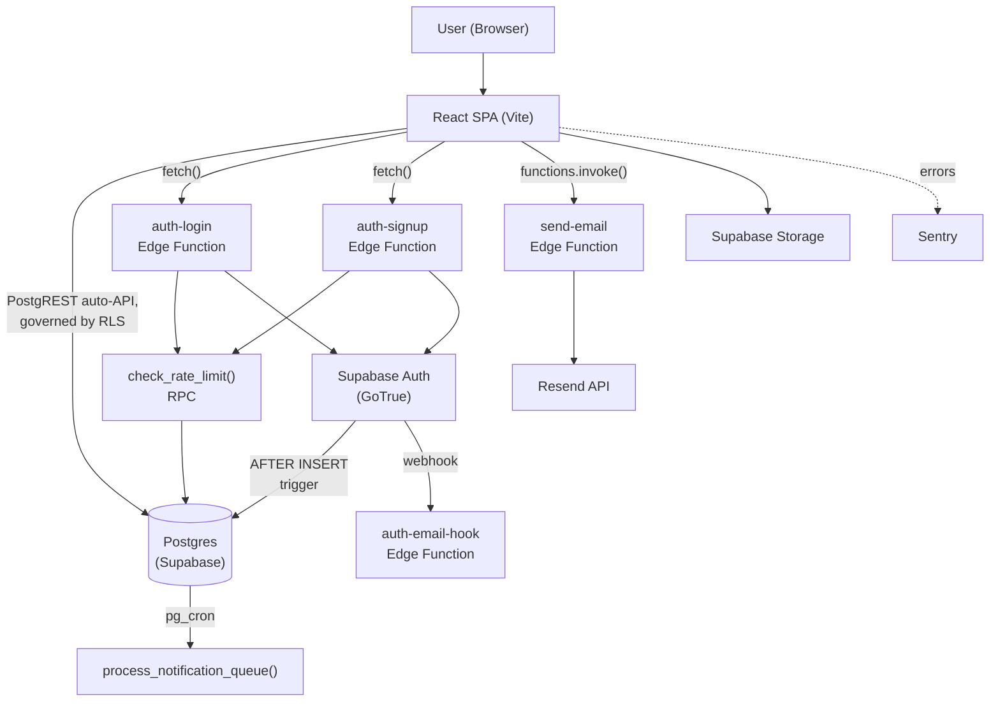
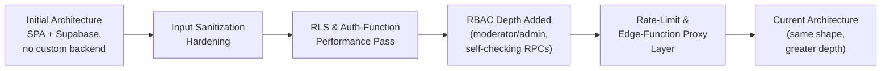
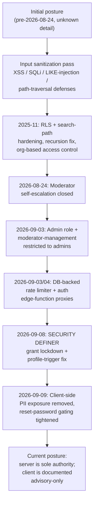
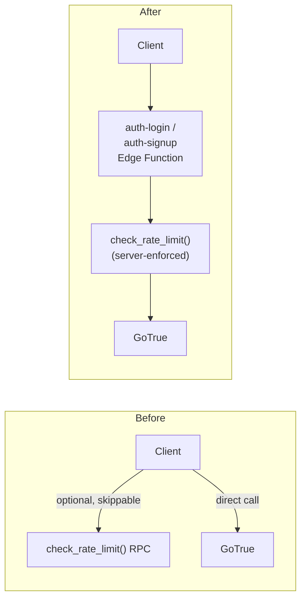
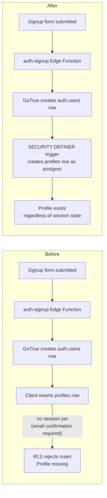

# System Evolution & Engineering Change Record

> Comprehensive technical history of the system from initial development to the current state.

**Repository:** `repro` (bmk-byte/repro) — "Repropulse Dashboard"
**Document generated:** 2026-09-09
**Evidence sources:** `git log` (full history, all branches), 124 files under [`supabase/migrations/`](../supabase/migrations/), `package.json` history, in-repo documentation ([`SECURITY.md`](../SECURITY.md), [`SANITIZATION_SUMMARY.md`](../SANITIZATION_SUMMARY.md)), CI/deploy configuration, and live production database inspection performed during this engagement.

Every historical claim in this document carries a confidence label:

> **Confirmed** — directly supported by a commit, migration file, or configuration in this repository, or by a live query against production made during this engagement.
>
> **Inferred** — a reasonable reading of available evidence, not directly stated anywhere in the repository.
>
> **Unknown** — no evidence exists in this repository to support or refute the claim.

---

## Table of Contents

1. [Executive Summary](#1-executive-summary)
2. [System Overview](#2-system-overview)
3. [Development Timeline](#3-development-timeline)
4. [Original System Architecture](#4-original-system-architecture)
5. [Current System Architecture](#5-current-system-architecture)
6. [Architecture Evolution](#6-architecture-evolution)
7. [Feature Evolution](#7-feature-evolution)
8. [Security Evolution](#8-security-evolution)
9. [Database Evolution](#9-database-evolution)
10. [API Evolution](#10-api-evolution)
11. [Frontend & UX Evolution](#11-frontend--ux-evolution)
12. [Performance & Optimisation Evolution](#12-performance--optimisation-evolution)
13. [Infrastructure & DevOps Evolution](#13-infrastructure--devops-evolution)
14. [Testing Evolution](#14-testing-evolution)
15. [Dependency Evolution](#15-dependency-evolution)
16. [Major Refactoring](#16-major-refactoring)
17. [Removed & Deprecated Functionality](#17-removed--deprecated-functionality)
18. [Breaking Changes](#18-breaking-changes)
19. [Technical Debt](#19-technical-debt)
20. [Development Patterns & Code Churn](#20-development-patterns--code-churn)
21. [Engineering Decisions](#21-engineering-decisions)
22. [Current System Health](#22-current-system-health)
23. [Original vs Current System](#23-original-vs-current-system)
24. [Master Chronological Changelog](#24-master-chronological-changelog)
25. [Outstanding Risks](#25-outstanding-risks)
26. [Recommended Future Improvements](#26-recommended-future-improvements)
27. [Current System Snapshot](#27-current-system-snapshot)
28. [Appendix — Evidence & Commit References](#28-appendix--evidence--commit-references)

---

## 1. Executive Summary

Repropulse Dashboard is a single-page React/Supabase application for tracking reproductive-rights and human-rights litigation cases across Africa, with a fast-intake "Rapid Response" module for time-sensitive cases. It has no custom backend of its own — Postgres (via Supabase), Row Level Security, Postgres functions, and four Edge Functions constitute the entire server side.

> **Historical confidence:** Confirmed
>
> The most important structural fact for anyone maintaining this repository is that its git history is not continuous. `master`'s earliest commit (`01a1c4d`, 2026-08-24) is a **root commit with no parent** — verified via `git log --format="%h %p"` returning an empty parent field — containing a full snapshot of an already-mature codebase: 122 database migrations dated back to 2025-03-31, dozens of React components, and a documented input-sanitization pass. Everything before 2026-08-24 exists in this repository only as static file content. **There is no commit-by-commit history for roughly 17 months of prior development.**

From 2026-08-24 onward, the history is complete and dense: 26 commits over 16 days, one author, covering a security-hardening pass, a full UX/design-system rebuild, an i18n rollout, rate limiting, bulk CSV import, and — in this engagement — a further security/reliability pass plus recovery of a broken CI/CD pipeline.

> **Historical confidence:** Confirmed
>
> A second major finding, discovered during this engagement rather than visible from git alone: production's actual database schema had been diverging from this repository's migration history for months, via direct edits through the Supabase Studio SQL editor rather than `supabase db push`. Nine "pending" local migrations turned out to already be live in production under 16 untracked migration-history entries. This was reconciled (not reversed) during this engagement — see [§13](#13-infrastructure--devops-evolution), [§19](#19-technical-debt), [§25](#25-outstanding-risks).

---

## 2. System Overview

| Layer | Technology | Evidence |
|---|---|---|
| Frontend | React 18 + TypeScript, Vite build, `react-router-dom` (two real routes; most navigation is in-component tab state) | `package.json`, [`src/App.tsx`](../src/App.tsx) |
| Styling | Tailwind CSS | `tailwind.config.js` |
| State management | None — no Redux/Zustand/React Query/SWR/Context; local `useState`/`useEffect` per component | Confirmed: no `createContext` usage found, no state library in `package.json` |
| Backend | None custom — Supabase Postgres + PostgREST auto-API + RLS + Postgres functions | [`src/lib/permissions.ts`](../src/lib/permissions.ts) explicitly documents "the app has no server-side API routes of its own" |
| Serverless functions | 4 Supabase Edge Functions: `auth-login`, `auth-signup`, `auth-email-hook`, `send-email` | [`supabase/functions/`](../supabase/functions/) |
| Auth | Supabase Auth (GoTrue), fronted by two edge-function proxies for rate limiting | [`src/components/Auth.tsx`](../src/components/Auth.tsx) |
| Database | Postgres via Supabase, 124 migrations, RLS on all major tables | [`supabase/migrations/`](../supabase/migrations/) |
| i18n | i18next / react-i18next, English + French | [`src/i18n/`](../src/i18n/) |
| Error monitoring | Sentry (`@sentry/react`), no-op unless `VITE_SENTRY_DSN` is set | [`src/lib/errorReporting.ts`](../src/lib/errorReporting.ts) |
| Testing | Vitest + Testing Library | [`src/test/setup.ts`](../src/test/setup.ts) |
| CI | GitHub Actions | [`.github/workflows/ci.yml`](../.github/workflows/ci.yml) |
| Hosting/Deploy | Vercel, connected to `master` | `vercel.json` |
| Domain | `www.repropulse.com` | `vercel.json` CSP; confirmed via linked Supabase project config |

---

## 3. Development Timeline

### Phase 1 — Pre-Git-History Foundation (reconstructed)

**Window:** 2025-03-31 → 2025-12-04. **No commit history exists for this period** — evidence is limited to migration file timestamps, migration SQL comments, and file content present at repo genesis.

- **2025-03-31 → 2025-07-03** (95 migration files, auto-generated Supabase names such as `delicate_math`, `round_thunder`): initial schema build-out.

  > **Historical confidence:** Inferred
  >
  > The auto-generated naming pattern, combined with `.bolt/config.json` and `.bolt/mcp.json` present in the earliest recoverable snapshot, suggests the initial application was built using an AI-assisted scaffolding tool (Bolt.new or similar). This is not confirmed by any commit message, since no commits exist for this period.

- **Gap:** 2025-07-03 → 2025-11-21 (~4.5 months), zero migrations. **Unknown** why.
- **2025-11-21 → 2025-12-04** (10 migrations, hand-written descriptive names): a concentrated hardening sprint — index and RLS-performance fixes, function search-path hardening, an infinite-recursion fix, organization-based access control. See [SYS-003](#sys-003--rls-performance--search-path-hardening-sprint).
- **Gap:** 2025-12-04 → 2026-08-24 (~8.5 months), zero migrations, no git history.

### Phase 2 — Git-History-Recorded Development

**Window:** 2026-08-24 → 2026-09-09 (16 days, 26 commits, single author: Michael Kuteesa). **Fully confirmed** by `git log`.

- **2026-08-24:** repository history reset (root commit) bundled with an immediate moderator-self-escalation fix, dead-code cleanup, code-splitting, and initial CI/tests.
- **2026-09-01 → 09-02:** UI component library, full UX/UI audit, dashboard consistency pass, font/branding alignment, landing-page redesign, transactional email, self-service password change.
- **2026-09-03** (the single busiest day, 8 commits): admin role, moderator-management restriction, Rapid Response pagination, DB-backed rate limiting begins, full French/English i18n rollout begins.
- **2026-09-04:** i18n rollout completes; login/signup rate-limit bypass closed via edge-function proxies.
- **2026-09-07:** bulk CSV upload, for both the main case list and Rapid Response.
- **2026-09-09** (this engagement): moderator-config PII exposure removed, four silent-failure patterns fixed, reset-password gating tightened, CI workflow's dead `main` branch reference fixed, a vitest hoisting bug fixed, and production migration-history drift discovered and reconciled.

---

## 4. Original System Architecture

> **Historical confidence:** Unknown
>
> The repository does not provide sufficient evidence to establish the system's true original architecture. The earliest state this repository can attest to is the 2026-08-24 root commit, which was already a mature application (~90 components, 122 migrations, a documented sanitization pass). No earlier snapshot exists in git. A "v1" or "MVP" state, if it ever existed, is not recoverable from this repository.

---

## 5. Current System Architecture

As of commit `418a337` (2026-09-09):

- **Client:** Vite-built React 18 SPA, TypeScript, Tailwind CSS. Only `/reset-password` and a catch-all route are real routes; everything else is component-level tab state inside `DashboardApp`.
- **Data access:** roughly 40 components call `supabase.from()` directly. No repository/service layer, no query cache. Field-scoped `.select()` and server-side `.range()` pagination are used in higher-traffic views (e.g., Rapid Response cases).
- **Auth:** `Auth.tsx` posts to `auth-login`/`auth-signup` Edge Functions rather than calling the Supabase SDK directly. These enforce `check_rate_limit()` before forwarding to GoTrue. Password reset uses the SDK directly (GoTrue self-rate-limits that endpoint). Profile rows are created by a `SECURITY DEFINER` trigger on `auth.users`, not client-side.
- **Authorization:** [`src/lib/permissions.ts`](../src/lib/permissions.ts) is an explicit, self-documented UI-only convenience layer. Real enforcement is entirely in Postgres — RLS policies plus `SECURITY DEFINER` RPCs (`admin_set_admin`, `admin_set_moderator`, `list_admins`, `list_moderators`) that each re-check the caller's own privilege flag, and triggers (`protect_privileged_profile_columns`) that silently revert any client attempt to write `is_moderator`/`is_admin`/`role` directly.
- **Rate limiting:** a single Postgres table (`rate_limits`) plus `check_rate_limit()`/`peek_rate_limit()`/`clear_rate_limit()`/`purge_expired_rate_limits()`, called from the auth Edge Functions and the CSV bulk-upload flow. Explicitly fails open on limiter RPC error — a documented availability trade-off.
- **i18n:** full English/French coverage, namespaced JSON under `src/i18n/locales/`.
- **Observability:** Sentry, no-op without a DSN.
- **Testing:** 15 Vitest assertions across 2 files.
- **CI/CD:** GitHub Actions on push to `master` and on PRs; Vercel auto-deploys `master` to production.

---

## 6. Architecture Evolution

There is no evidence of a framework or backend rewrite anywhere in this repository — no migration off a different frontend framework, no move to a custom backend. The architecture's shape (SPA + Supabase, no custom API server) is unchanged from repo genesis to the current commit. What evolved is depth within that shape: authorization moved from "trust the client, hide the button" toward "the database is the only authority" (§8), and the data layer gained pagination and field-scoping in specific hot paths (§12) without ever gaining a shared service/query layer.

---

## 7. Feature Evolution

| Feature | Introduced | Evidence |
|---|---|---|
| Core case tracking (Cases, Judgments, Laws Repository) | Pre-2026-08-24 (unknown exact date) | Present at repo genesis |
| Rapid Response fast-intake module | Pre-2026-08-24; paginated 2026-09-03 | `RapidResponseCasesPage.tsx` at genesis; `8356aa7` |
| Moderation workflow | Pre-2026-08-24 | `ModerationPage.tsx` at genesis |
| Shared UI component library | 2026-09-01 | `cd8d65e` |
| Admin role (separate from moderator) | 2026-09-03 | `20260903080000_add_admin_role.sql`, `9991ae0`/`d0b3a4e` |
| Transactional email (Resend) + password-changed notifications | 2026-09-02 | `91fc675`, `d869cb6` |
| French/English UI language support | 2026-09-03 → 09-04 | `a988a3d` through `89ad790` |
| DB-backed rate limiting (login/signup/bulk-upload) | 2026-09-03 → 09-04 | `20260903071500`, `20260903120000`, `74a5005` |
| Bulk CSV upload (Cases, then Rapid Response) | 2026-09-07 | `8bca093`, `d86c31f` |
| Auth-proxy edge functions | 2026-09-04 | `74a5005` |
| Profile-creation-via-trigger | Authored 2026-09-08; confirmed live in production 2026-09-09 | `20260908110000` |

---

## 8. Security Evolution

### SYS-002 — Input Sanitization Hardening Pass

**Date:** Unknown (pre-2026-08-24, present at repo genesis) &nbsp;·&nbsp; **Category:** Security &nbsp;·&nbsp; **Status:** Implemented &nbsp;·&nbsp; **Priority:** High &nbsp;·&nbsp; **Evidence:** [`SECURITY.md`](../SECURITY.md), [`SANITIZATION_SUMMARY.md`](../SANITIZATION_SUMMARY.md), [`src/lib/sanitize.ts`](../src/lib/sanitize.ts)

> **Historical confidence:** Confirmed (existence and content) / Unknown (exact date)

**Before:** `SANITIZATION_SUMMARY.md` documents vulnerable patterns directly: raw search terms passed into `.ilike()` (LIKE-injection), unescaped filenames rendered to the DOM, unvalidated URLs passed to ``.

**Change:** A sanitization library (`sanitize.ts`) and `useSanitizedInput` hook were introduced, applied across `SubmitCaseForm.tsx`, `SubmitJudgmentForm.tsx`, `EditCaseModal.tsx`, `ProfileSettingsForm.tsx`, `UploadLawModal.tsx`, `UploadResourceModal.tsx`, `CasesPage.tsx`, `CasesTable.tsx`, `JudgmentsPage.tsx`.

**Technical Implementation:** text/HTML/URL/filename/search-term/email/phone/array sanitizers; file-type and size validation; LIKE-wildcard escaping (`%`, `_`, `\`).

**Impact:** Closed XSS, LIKE-injection, and path-traversal vectors across every user-facing form and search field present at the time.

**Security Impact:** Reduced injection and XSS attack surface; established a reusable sanitization convention still in use today.

**Testing:** `SANITIZATION_SUMMARY.md` documents manual test procedures (script-tag injection, SQL-like payloads, wildcard injection, protocol-relative URLs, directory traversal). No automated tests for `sanitize.ts` existed until later (see [§14](#14-testing-evolution)).

---

### SYS-003 — RLS Performance & Search-Path Hardening Sprint

**Date:** 2025-11-21 → 2025-12-04 &nbsp;·&nbsp; **Category:** Security, Performance &nbsp;·&nbsp; **Status:** Implemented &nbsp;·&nbsp; **Priority:** High &nbsp;·&nbsp; **Evidence:** `20251121214822_add_missing_foreign_key_indexes.sql` through `20251204050602_organization_based_case_access_control.sql` (10 files)

> **Historical confidence:** Confirmed (migration content) / Inferred (triggering cause)

**Before:** RLS policies re-evaluated `auth.*()` functions per row; some `SECURITY DEFINER` functions lacked pinned `search_path`; `profiles` RLS had an infinite-recursion bug; duplicate policies existed on some tables.

**Change:** Ten migrations: missing foreign-key indexes added, RLS policies rewritten to batch `auth.*()` evaluation, function search paths pinned (`fix_function_search_paths_v3` — the "v3" implies at least two earlier, unpreserved attempts), the `profiles` infinite-recursion bug fixed, unused indexes removed, duplicate policies consolidated, Rapid Response edit permissions restricted, organization-based case access control introduced.

**Technical Implementation:** `ALTER FUNCTION ... SET search_path`, RLS policy rewrites wrapping `auth.uid()` in subqueries, `CREATE INDEX` on previously-unindexed foreign keys, `DROP INDEX` on unused ones.

**Impact:** Reduced planner overhead per RLS-guarded query; closed a real availability bug (infinite recursion); reduced attack surface from mutable search paths.

**Security Impact:** Pinned search paths close a class of function-hijacking risk in Postgres; the recursion fix is a reliability fix with security-adjacent blast radius (a recursive RLS policy can effectively deny service).

**Testing:** No test evidence found for this window (predates the test suite visible in this repository).

> **Historical confidence:** Inferred
>
> The naming and content pattern (RLS `auth.*()` batching, search-path pinning) is consistent with responding to a Supabase database linter/advisor report, a pattern repeated explicitly in `20260908100000` ("Supabase's database linter flagged..."). The actual audit source for this 2025-11 sprint is not stated anywhere in the repository.

---

### SYS-004 — Repository History Reset & Moderator Self-Escalation Fix

**Date:** 2026-08-24 &nbsp;·&nbsp; **Category:** Security, Architecture, Testing &nbsp;·&nbsp; **Status:** Implemented &nbsp;·&nbsp; **Priority:** Critical &nbsp;·&nbsp; **Evidence:** `01a1c4d`, `20260824113626_lock_is_moderator_column.sql`

**Before:** The `profiles` RLS policy "Users can update own profile" was row-scoped (`auth.uid() = id`) but not column-scoped, meaning any authenticated client could call `.update({is_moderator: true})` on their own row and self-grant moderator status.

**Change:** A `BEFORE UPDATE` trigger (`protect_privileged_profile_columns`) now silently reverts `is_moderator`/`role` unless the write comes from `service_role`/`supabase_admin`/`postgres`, or a trusted RPC has set a transaction-local sentinel. A `BEFORE INSERT` trigger (`auto_grant_moderator_to_approved_emails`) derives `is_moderator` from a server-side allow-list, superseding an untracked ad hoc script (`GRANT_MODERATOR_ACCESS.sql`).

**Technical Implementation:** Two Postgres triggers, `SECURITY DEFINER`, `SET search_path = pg_catalog, public`; also bundled in this commit: dead-code cleanup, code-splitting (lazy-loaded route chunks), initial CI workflow, initial Vitest setup.

**Impact:** Closed a real, exploitable privilege-escalation path. Bundled with unrelated cleanup/testing/CI work in a single commit.

**Security Impact:** Critical — this is the single most significant access-control fix visible in this repository's history.

**Testing:** `useModeratorStatus.test.ts` was introduced as a regression guard specifically for this vulnerability class (asserting the hook never calls `.update()`/`.upsert()` on `profiles`).

---

### SYS-009 — Admin Role Introduction & Moderator-Management Restriction

**Date:** 2026-09-03 &nbsp;·&nbsp; **Category:** Security, Architecture &nbsp;·&nbsp; **Status:** Implemented &nbsp;·&nbsp; **Priority:** High &nbsp;·&nbsp; **Evidence:** `20260903080000_add_admin_role.sql`, `20260903090000_restrict_moderator_management_to_admins.sql`, `9991ae0`, `d0b3a4e`

**Before:** A single `is_moderator` flag existed; any moderator could grant or revoke moderator status on any account, including their own peers, with no separate administrative tier.

**Change:** An `is_admin` column was added as a strict superset of moderator. Rather than rewriting the 12 RLS policies that call `current_user_is_moderator()`, that function's own definition was redefined to mean "moderator OR admin." `admin_set_moderator`/`list_moderators` were restricted to admins only; `admin_set_admin`/`list_admins`/`current_user_is_admin` were added, each independently re-checking `is_admin` before acting.

**Technical Implementation:** `ALTER TABLE profiles ADD COLUMN is_admin`; `CREATE OR REPLACE FUNCTION` for the superset trick; new `SECURITY DEFINER` RPCs with internal privilege checks and `audit_logs` writes on every grant/revoke.

**Impact:** Separated "who can moderate content" from "who can grant moderation," closing a lateral-privilege gap.

**Security Impact:** High — removes peer-to-peer privilege escalation among moderators; every admin action is now audit-logged.

**Testing:** No automated test coverage found for these RPCs.

---

### SYS-011 — DB-Backed Rate Limiting Infrastructure

**Date:** 2026-09-03 → 09-04 &nbsp;·&nbsp; **Category:** Security, Reliability &nbsp;·&nbsp; **Status:** Implemented &nbsp;·&nbsp; **Priority:** High &nbsp;·&nbsp; **Evidence:** `20260903071500_add_rate_limiting.sql`, `20260903120000_allow_anon_rate_limit_checks.sql`, `74a5005`

**Before:** No server-side rate limiting on login, signup, or bulk upload beyond whatever GoTrue provides natively.

**Change:** A `rate_limits` table plus `check_rate_limit()` (atomic fixed-window upsert, avoiding a read-then-write race under concurrent requests), `peek_rate_limit()`, `clear_rate_limit()`, `purge_expired_rate_limits()` (scheduled via `pg_cron` every 5 minutes). `check_rate_limit()` granted to `anon` specifically because login/signup happen before a session exists.

**Technical Implementation:** `INSERT ... ON CONFLICT DO UPDATE` with a `CASE` expression resetting the window; RLS enabled and deny-all on `rate_limits` (all access goes through the `SECURITY DEFINER` functions).

**Impact:** Login/signup/bulk-upload abuse now has a server-enforced ceiling.

**Security Impact:** High. Explicitly fails open on limiter RPC error — a documented availability-over-strictness trade-off (see [§21](#21-engineering-decisions)).

**Testing:** No automated test coverage found for the rate-limiting functions themselves.

---

### SYS-013 — Login/Signup Rate-Limit Bypass Closure via Edge-Function Proxies

**Date:** 2026-09-04 &nbsp;·&nbsp; **Category:** Security &nbsp;·&nbsp; **Status:** Implemented &nbsp;·&nbsp; **Priority:** High &nbsp;·&nbsp; **Evidence:** `74a5005`

**Before:** `check_rate_limit()` was callable as a client-side RPC, but the client also called `supabase.auth.signInWithPassword()`/`signUp()` directly. Any caller could skip the RPC entirely and hit GoTrue directly, bypassing rate limiting completely.

**Change:** Login and signup now POST to `auth-login`/`auth-signup` Edge Functions, which call `check_rate_limit()` server-side (via the service-role key) for both a per-email and per-IP key, then forward the request to GoTrue's own `/auth/v1/token`/`/auth/v1/signup` and pass the response through verbatim.

**Technical Implementation:** [`supabase/functions/auth-login/index.ts`](../supabase/functions/auth-login/index.ts), [`auth-signup/index.ts`](../supabase/functions/auth-signup/index.ts); [`src/components/Auth.tsx`](../src/components/Auth.tsx) `callAuthProxy()` helper.

**Impact:** Rate limiting can no longer be bypassed by any caller, including one that skips the app's own client code entirely.

**Security Impact:** High — closes a complete bypass of a security control introduced only a day earlier ([SYS-011](#sys-011--db-backed-rate-limiting-infrastructure)).

**Testing:** No automated test coverage found for the edge functions.

---

### SYS-015 — SECURITY DEFINER Grant Lockdown & Profile-Creation Trigger Fix

**Date:** 2026-09-08 (authored); confirmed live in production 2026-09-09 &nbsp;·&nbsp; **Category:** Security, Reliability &nbsp;·&nbsp; **Status:** Implemented (confirmed live) &nbsp;·&nbsp; **Priority:** Critical &nbsp;·&nbsp; **Evidence:** `20260908100000_lock_down_security_definer_function_grants.sql`, `20260908110000_create_profile_via_auth_trigger.sql`

**Before:** 13 `SECURITY DEFINER` functions (`check_rate_limit`, `admin_set_admin`, `list_admins`, `process_notification_queue`, etc.) retained the default Postgres `PUBLIC` execute grant despite migration comments claiming restriction, meaning `anon`/`authenticated` could invoke them at the grant level even though each function separately re-checked caller privilege internally. Separately, signup for accounts requiring email confirmation returned no session, so the client-side `profiles` insert (requiring `auth.uid()`) was rejected by RLS — every confirmation-pending signup lost its profile row.

**Change:** `REVOKE ALL ... FROM PUBLIC, anon[, authenticated]` then precise re-grants for each of the 13 functions. A `SECURITY DEFINER` trigger (`handle_new_auth_user`) on `auth.users` now creates the `profiles` row as `postgres`, bypassing RLS regardless of session state, plus a backfill `INSERT ... WHERE p.id IS NULL` for already-affected accounts.

**Technical Implementation:** Grant/revoke statements are fully idempotent (safe to re-run); the trigger and backfill are `ON CONFLICT DO NOTHING`-guarded.

**Impact:** Closed a defense-in-depth gap on 13 privileged functions; fixed a real, user-facing signup bug.

**Security Impact:** Critical — this is the class of fix that, combined with a coding error elsewhere, could otherwise have escalated into an actual bypass.

**Testing:** No automated test coverage. Both changes were independently verified live in production during this engagement via direct read-only SQL queries (see [SYS-019](#sys-019--production-schema-drift-discovery--migration-history-reconciliation)).

---

### SYS-016 — Moderator-Config PII Exposure Removal & Silent-Failure Remediation

**Date:** 2026-09-09 &nbsp;·&nbsp; **Category:** Security, Reliability &nbsp;·&nbsp; **Status:** Implemented &nbsp;·&nbsp; **Priority:** High &nbsp;·&nbsp; **Evidence:** `fb61719`

**Before:** `src/lib/moderatorService.ts` read `VITE_MODERATOR_CONFIG` — a JSON map of `{organization: moderatorEmail}` — bundled verbatim into the shipped client JS, exposing every partner organization's moderator email address. This config had already been superseded as the authorization source of truth by `20260903080000`'s server-side allow-list, but the client-side advisory check (`validateModeratorOrganization`, called from `Auth.tsx`) still ran against it, meaning it could silently drift out of sync with the real list. Separately, `storage.getFreshFileUrl()` silently returned a stale/broken URL on signed-URL failure instead of surfacing the error (its callers already had unused `.catch()` handlers), and four Supabase fetches in `RapidResponseCasesPage.tsx` (current user, team members, partner orgs, countries) caught errors into `console.log` only, with no user feedback or monitoring.

**Change:** `moderatorService.ts` deleted; the client-side org-mismatch validation removed from `Auth.tsx`. `storage.ts` now throws (and reports to Sentry) on signed-URL failure instead of silently falling back. The four silent Supabase fetch failures now show a toast and report to Sentry. Bulk-upload row/submit failures now show a translated generic message instead of a raw, untranslated Postgres error string.

**Technical Implementation:** `git rm src/lib/moderatorService.ts`; edits to `Auth.tsx`, `ResetPassword.tsx` (also tightened to gate on `PASSWORD_RECOVERY` only, not any `SIGNED_IN` event), `storage.ts`, `RapidResponseCasesPage.tsx`, `BulkCaseUpload.tsx`, `BulkRapidResponseUpload.tsx`; new i18n keys added to `forms.en.json`/`forms.fr.json`/`rapidResponse.en.json`/`rapidResponse.fr.json`.

**Impact:** No more moderator PII in the client bundle; four previously-invisible failure modes now surface to users and to monitoring.

**Security Impact:** Medium-High — closes a real data-exposure issue and removes a source of authorization-adjacent client/server drift, though the underlying privilege model was already server-enforced.

**Testing:** `npx tsc --noEmit` (clean), `npx vitest run` (15/15 passing), lint diff-checked against the pre-change baseline (no new issues introduced) — all performed during this engagement, no dedicated new automated test written for these specific fixes.

---

## 9. Database Evolution

**Timeline:**

1. **2025-03 → 2025-07** (95 migrations, auto-named): initial schema build-out. **Unknown** in per-table detail — not exhaustively reviewed file-by-file given the volume and lack of accompanying commit context.
2. **2025-11 → 2025-12** (10 migrations): index/RLS/search-path hardening pass ([SYS-003](#sys-003--rls-performance--search-path-hardening-sprint)).
3. **2026-08 → 2026-09** (12 migrations, hand-named and richly commented): moderator/admin RBAC build-out, rate limiting, storage upload limits, grant lockdown, profile-creation trigger fix.
4. **Parallel, undocumented track:** 16 migration-history entries exist in production with no corresponding file in this repository, spanning 2025-04-01 through 2026-09-08 — see [SYS-019](#sys-019--production-schema-drift-discovery--migration-history-reconciliation).

**Total migration files:** 124. **Tables confirmed to have RLS enabled** (non-exhaustive grep): `profiles`, `projects`, `data_entries`, `case_summaries`, `expert_commentaries`, `law_documents`, `case_documents`, `case_stages`, `judgments`, `pending_submissions`, `routing_audit_log`, `audit_logs`, `cases`, `countries`, `health_indicators`, `app_settings`, `pending_cases`, `pending_judgments`, `rate_limits`.

---

## 10. API Evolution

This application has no conventional REST/GraphQL API of its own. "Endpoints" are either Supabase's auto-generated PostgREST API (governed entirely by RLS) or the four Edge Functions below.

| Endpoint | Initial State | Changes | Current State | Breaking? |
|---|---|---|---|---|
| `auth-login` | Introduced 2026-09-04 (`74a5005`) | None since introduction | Proxies GoTrue's `/auth/v1/token`; enforces `check_rate_limit()` (5/300s per email, 20/300s per IP); fails open on limiter RPC error | No |
| `auth-signup` | Introduced 2026-09-04 (`74a5005`) | None since introduction | Same pattern (3/3600s per email, 10/3600s per IP) | No |
| `auth-email-hook` | Pre-2026-08-24 (unknown exact date) | Verification-link host bug fixed 2026-09-02 (`a629034`) | Sends signup/verification emails | No — corrective |
| `send-email` | Pre-2026-08-24 | None recorded | Thin wrapper via `supabase.functions.invoke`, no retry/timeout | No |

Postgres RPC functions (`SECURITY DEFINER`) are the closest analog to a private API surface and are the most actively evolved part of the system — see [§8](#8-security-evolution).

---

## 11. Frontend & UX Evolution

- **2026-09-01:** shared UI component library introduced (`cd8d65e`).
- **2026-09-02:** "Full UX/UI audit" (`492c096`) covering bug fixes, design-system adoption, forms normalization; a persistent tab-switch-resets-to-Dashboard bug fixed (`7c56089`); fonts switched to match the parent organization's site (`674a5ec`); a broader visual-consistency pass (`7ddf9d0`); landing page redesigned "as a single viewport" (`9991ae0`, 2026-09-03).
- **2026-09-03 → 09-04:** the entire UI translated into French, namespace by namespace, across 8 commits — dashboard, cases/judgments, forms, Rapid Response, analytics, report generation, navbar/aria-labels, case progress tracker, stage modal.
- **2026-09-02:** Tawk.to live chat widget removed (`68ca75d`, bundled into an i18n commit). **Unknown** why it was removed in the same commit as an unrelated i18n change.
- **2026-09-09** (this engagement): four silent failure modes now surface toasts; bulk-upload errors now show translated generic messages instead of raw Postgres text — see [SYS-016](#sys-016--moderator-config-pii-exposure-removal--silent-failure-remediation).

---

## 12. Performance & Optimisation Evolution

- **2025-11-21:** RLS policies rewritten to avoid per-row re-evaluation of `auth.*()` functions — a standard Postgres/Supabase performance pattern. No before/after query timings exist in the repository.
- **2025-12-01:** unused indexes removed; duplicate RLS policies consolidated.
- **2025-11-21:** missing foreign-key indexes added.
- **2026-09-03:** Rapid Response cases list moved from full-set loading to server-side `.range()` pagination (`8356aa7`).
- **2026-09-03:** lazy-loaded tab chunks prefetched (`d0b3a4e`).
- No caching layer (React Query/SWR) has ever been introduced — every component refetches its own data on mount. Unaddressed — see [§19](#19-technical-debt).

---

## 13. Infrastructure & DevOps Evolution

- **Deploy target:** Vercel, confirmed connected to `master` during this engagement.
- **CI:** `.github/workflows/ci.yml`, introduced 2026-08-24, targeted `branches: [main]`.

  > **Historical confidence:** Confirmed
  >
  > A `main` branch existed at some point (a stale local remote-tracking ref, and a disconnected `origin/main` snapshot commit, `db105bb`, dated the same calendar day as this repo's own root commit) but had been deleted by the time of this engagement. CI's push trigger had likely never fired on a real push for the life of this workflow — only `pull_request` events would have run it. Fixed 2026-09-09 (`0f2a2cb`) to target `master`.

- **Supabase project linkage:** this checkout had never been `supabase link`ed locally before 2026-09-09; the globally-installed CLI (v1.226.4) was itself out of date against the latest (v2.117.0).

### SYS-019 — Production Schema Drift Discovery & Migration History Reconciliation

**Date:** 2026-09-09 &nbsp;·&nbsp; **Category:** Infrastructure, Security &nbsp;·&nbsp; **Status:** Reconciled (process gap remains open) &nbsp;·&nbsp; **Priority:** Critical &nbsp;·&nbsp; **Evidence:** `supabase migration list` output against the linked project (`zvaurxgtttrgyvjzoedc`), live read-only SQL queries, this engagement's session record

**Before:** This repository's 124 migration files were assumed to represent production's actual schema history.

**Change:** `supabase migration list` revealed 9 local migrations never applied to production (dating back to 2025-08-24) and 16 production migration-history entries with no corresponding local file, timestamped minutes-to-hours after several local files — a pattern consistent with direct edits via the Supabase Studio SQL editor. Live queries confirmed all 9 "pending" local migrations were, in fact, already effectively applied to production (the `is_admin` column, `rate_limits` table, `admin_set_admin` function, the `on_auth_user_created` trigger, and the grant lockdown all already existed/were in effect). `supabase migration repair --status applied` was run twice (7 versions, then 2) to mark these as applied in production's bookkeeping table without re-executing their SQL — which would otherwise have failed (e.g., `ALTER TABLE ... ADD COLUMN is_admin` would error if the column already existed).

**Technical Implementation:** `supabase migration repair --status applied <versions>` (bookkeeping-only, no SQL executed); confirmation via `has_function_privilege()` and `pg_proc`/`pg_trigger`/`information_schema` queries before every repair, to avoid masking a genuinely-pending change as already-applied.

**Impact:** Local and remote migration history now correspond 1:1. No schema changes were actually applied to production during this reconciliation — everything found was already live.

**Security Impact:** The reconciliation itself is neutral (no schema change), but the underlying process gap — nothing prevents direct SQL-editor edits from bypassing this repository's migration history — is an active, ongoing risk. See [§19](#19-technical-debt), [§25](#25-outstanding-risks).

**Testing:** Not applicable (infrastructure/database operation, not application code). Verified via direct read-only production queries, documented in this engagement's session record.

---

## 14. Testing Evolution

| Date | Change | Evidence |
|---|---|---|
| 2026-08-24 (repo genesis) | Vitest + Testing Library configured; `sanitize.test.ts`, `useModeratorStatus.test.ts` present | `01a1c4d` |
| 2026-09-09 (this engagement) | `useModeratorStatus.test.ts`'s `vi.mock` factory fixed (`vi.hoisted()`) — it referenced top-level `const` spies directly, which happened to work with whatever vitest build was cached locally but failed on CI's clean install | `418a337` |

> **Historical confidence:** Inferred
>
> Because this test's mock factory only failed under a fresh `npm ci` install (reproduced during this engagement) and CI's push trigger had likely never fired before ([§13](#13-infrastructure--devops-evolution)), this specific regression test may never have actually run successfully in CI prior to 2026-09-09.

No test coverage exists for `src/lib/permissions.ts`, CSV bulk-upload row validation, the rate-limiting Postgres functions, or any Edge Function. No E2E framework is present. Coverage has only grown since genesis (2 files, deeper assertions) — no test file has been removed.

---

## 15. Dependency Evolution

`package.json` appears in only 4 of the 26 recorded commits; the rest of the dependency set was fixed at repo genesis and is therefore **unknown** relative to real development activity.

| Date | Commit | Change |
|---|---|---|
| 2026-09-03 | `8356aa7` | Removed `i18next` (^23.10.1), `i18next-browser-languagedetector`, `i18next-http-backend`, `react-i18next` (^14.1.0), `zod` (^3.22.4) — commit message includes "cleanup" |
| 2026-09-03 (same day, later) | `a988a3d` | Re-added `i18next` at ^26.4.1 and `react-i18next` at ^17.0.13 (both major-version jumps) to build the French/English rollout |
| 2026-09-07 | `8bca093` | Added `papaparse` (^5.7.0) + `@types/papaparse` for CSV bulk upload |

> **Historical confidence:** Inferred
>
> `i18next`/`react-i18next` were removed as unused cleanup and reintroduced, at newer major versions, hours later the same day — see [§20](#20-development-patterns--code-churn). `zod` was removed and never reintroduced within the recorded window; whether it is still needed elsewhere is unknown.

Genesis-state dependencies not otherwise discussed: `@sentry/react`, `@supabase/supabase-js`, `@tremor/react`, `@visx/*`, `cobe`, `framer-motion`, `react-dropzone`, `react-hot-toast`, `react-pdf`/`pdfjs-dist`, `recharts`, `topojson-client`.

---

## 16. Major Refactoring

- **2026-09-01, code-splitting** (`01a1c4d` scope): lazy-loaded route/tab chunks, later complemented by prefetching (`d0b3a4e`).
- **2026-09-01, shared UI component library** (`cd8d65e`): consolidation of previously-duplicated component styling. Extent of duplication removed is inferred, not independently diffed file-by-file.
- **2026-09-03, RBAC superset trick** (`20260903080000`): `current_user_is_moderator()` redefined to mean "moderator OR admin" rather than rewriting 12 dependent RLS policies — see [§21](#21-engineering-decisions).

---

## 17. Removed & Deprecated Functionality

| Removed/Deprecated | When | Replaced by | Evidence |
|---|---|---|---|
| `GRANT_MODERATOR_ACCESS.sql` (untracked ad hoc script) | Superseded circa 2025-11 timeframe (exact date unknown; predates git history) | `auto_grant_moderator_to_approved_emails()` trigger | `20260824113626` comment: "supersedes the untracked GRANT_MODERATOR_ACCESS.sql script" |
| Tawk.to live chat widget (`TawkChat.tsx`) | 2026-09-02 | Not replaced | `68ca75d` |
| `src/lib/moderatorService.ts` + `VITE_MODERATOR_CONFIG` | 2026-09-09 | Server-side allow-list (already the real source of truth since `20260903080000`) | `fb61719` |
| `zod` dependency | 2026-09-03 | Unknown | `8356aa7` |
| `i18next` v23 / `react-i18next` v14 | Removed 2026-09-03 | `i18next` v26 / `react-i18next` v17, same day | `8356aa7` -> `a988a3d` |
| Client-side org-mismatch signup validation | 2026-09-09 | Nothing — removed as a dead-weight, drift-prone UX advisory | `fb61719` |

---

## 18. Breaking Changes

| Change | What broke | Affected | Handling | Migration required |
|---|---|---|---|---|
| `check_rate_limit()` moved behind edge-function proxies | A caller invoking GoTrue directly would bypass the app's own rate-limit UX | Only this app's own client, updated in the same commit | Handled atomically within `74a5005` | No |
| `is_moderator`/`is_admin`/`role` became trigger-protected against client writes | Any code path relying on a direct `.update()` to these columns | None found — no such path existed outside the RPCs | Trigger-level, transparent to legitimate callers | No |
| `VITE_MODERATOR_CONFIG` removed | Deployment configuration still setting this env var now has it silently ignored | Deployment configuration only | Not yet cleaned up — see [§25](#25-outstanding-risks) | Recommended: remove from Vercel project settings |
| CI workflow branch target changed `main` -> `master` | None — `main` no longer existed | N/A | N/A | No |

No breaking changes to the Postgres schema's external shape (column removals, type changes) were found in the git-recorded window.

---

## 19. Technical Debt

### Critical

- **Production schema drift via direct SQL-editor edits, bypassing migration history.** Location: Supabase project + `supabase/migrations/`. Nothing in CI or process currently prevents recurrence. See [SYS-019](#sys-019--production-schema-drift-discovery--migration-history-reconciliation).

### High

- **No shared data-access layer.** ~40 components call `supabase.from()` directly with inconsistent error handling. Location: `src/components/`.
- **No test coverage for authorization-adjacent business logic** (`src/lib/permissions.ts`, CSV upload validation, rate-limiting functions).

### Medium

- **`Auth.tsx` is the highest-churn file in the git-recorded history** (8 of 26 commits) and is also the most security-sensitive file in the app.
- **No caching/query-dedup layer** — every tab switch or remount refetches lookups already fetched elsewhere in the same session.
- **CI lint step is non-blocking**, with an explicit code comment acknowledging a pre-existing lint backlog.

### Low

- **`supabase` CLI version pinned in `package.json` (1.200.3) is several major versions behind** the version needed to operate this engagement's migration reconciliation (1.226.4, itself behind the latest 2.117.0).
- **`zod` removal** — unclear whether validation elsewhere fully replaced it, or whether it was genuinely unused.

---

## 20. Development Patterns & Code Churn

> **Historical confidence:** Inferred
>
> The git-history reset itself is the single largest development-pattern signal in this repository. A root commit containing a fully mature application, on the same calendar date that a disconnected snapshot commit ("Start repository," authored by a different account, `michaelgolbachev-cell`) was pushed to what was then `origin/main`, suggests a GitHub-connected AI scaffolding tool re-syncing its own copy of the repository and overwriting history in the process. This is not confirmed by any commit message or configuration; future maintainers should not assume any git history predates 2026-08-24.

- **High churn in `Auth.tsx`** (8/26 commits) coincides with it being the single entry point for both auth flows and moderator-signup UX — every rate-limiting change, i18n rollout, PII-exposure fix, and moderator-signup-validation change touched it.
- **i18n locale JSON files are the highest-raw-churn files** (4 touches each for the Rapid Response locale files) — expected for a systematic, namespace-by-namespace translation rollout.
- **A same-day dependency reversal** (`i18next` removed then re-added hours later at a newer major version, [§15](#15-dependency-evolution)) suggests a "cleanup" commit removed packages that were about to be used by a feature already in flight the same day.
- **Documented, deliberate one-function-instead-of-many-policies decisions** (the `current_user_is_moderator()` superset trick) indicate migration authors writing detailed rationale directly into SQL comments — an unusually good practice that made [§8](#8-security-evolution) far more evidence-rich than it would otherwise be.
- **No evidence of repeated rewrites or architectural instability** within the git-recorded window — changes are additive and corrective, not oscillating.

---

## 21. Engineering Decisions

**Decision:** Extend `current_user_is_moderator()` to mean "moderator OR admin" rather than rewriting every dependent RLS policy.
**Context:** Introducing `is_admin` needed to grant admins everything moderators have, across 12 existing RLS policies.
**Options considered:** Not explicitly enumerated; the comment implies the alternative (rewriting all 12 policies) was considered and rejected.
**Chosen approach:** Redefine the shared helper function; leave the 12 policies untouched.
**Reason:** *(Confirmed, from migration comment)* "one function change instead of a dozen policy rewrites, so no table can be missed."
**Trade-offs:** A separate `current_user_is_admin()` was needed for checks that must exclude moderators, so callers must know which of the two functions they need.
**Current status:** Live, unmodified since 2026-09-03.

**Decision:** Fail open (not closed) when the rate-limiter RPC itself errors.
**Context:** Login/signup/bulk-upload flows call `check_rate_limit()`, which could itself fail.
**Options considered:** Not enumerated; the choice is stated as deliberate, not weighed against alternatives in the available evidence.
**Chosen approach:** Allow the request through on RPC error rather than blocking it.
**Reason:** *(Confirmed, from code comments)* "a limiter outage never blocks login."
**Trade-offs:** During a limiter outage, rate limiting is effectively disabled with no built-in alerting.
**Current status:** Live, unmodified.

**Decision:** Move profile-row creation from client-side to a `SECURITY DEFINER` trigger on `auth.users`.
**Context:** Email-confirmation-required signups return no session, so the client-side insert (requiring `auth.uid()`) was rejected by RLS.
**Options considered:** Not enumerated; the trigger is presented as the fix, not compared against alternatives (e.g., relaxing the RLS policy).
**Chosen approach:** `SECURITY DEFINER` trigger running as `postgres`, bypassing RLS for this one narrow insert.
**Reason:** *(Confirmed, migration comment)* every confirmation-pending signup hit this bug.
**Trade-offs:** None noted; a backfill was included for already-affected accounts.
**Current status:** Confirmed live in production.

For all decisions not covered above (e.g., why Supabase over a custom backend, why no state-management library was ever adopted): **decision rationale not recoverable from available repository history.**

---

## 22. Current System Health

| Area | Rating | Evidence |
|---|---|---|
| Architecture | Good | Consistent shape maintained throughout recorded history; no data-access abstraction is a real gap as component count grows |
| Security | Good | Active, well-documented hardening trail with self-checking server-side RPCs and RLS as sole authority; held back by the confirmed schema-drift process gap |
| Reliability | Needs Improvement | Multiple previously-silent failure modes fixed this engagement, but the pattern likely persists in untouched components; no retry/timeout on external calls |
| Performance | Good | Concrete, evidenced optimizations exist but no caching layer and no recorded metrics |
| Maintainability | Needs Improvement | High churn in the most security-sensitive file; no shared data layer; CI lint non-blocking with an acknowledged backlog |
| Testing | Needs Improvement | Valuable regression tests exist for the two most security-relevant modules touched; RBAC, CSV validation, and Edge Functions are untested |
| Documentation | Good | Two detailed, accurate in-repo security documents; unusually well-commented migrations |
| Scalability | Needs Improvement | No caching, no data-access layer, and a discovered schema-management process gap will compound with growth |

---

## 23. Original vs Current System

| Area | Original System (earliest recoverable state, 2026-08-24) | Current System (2026-09-09) | Major Evolution |
|---|---|---|---|
| Architecture | SPA + Supabase, no custom backend | Same shape | No structural change |
| Authentication | Direct SDK calls (inferred pre-genesis state) | Edge-function-proxied login/signup with DB-backed rate limiting | Rate-limit-bypass-proof flow added 2026-09-04 |
| Authorization | Row-scoped RLS only; `is_moderator` client-writable (the vulnerability fixed in the first recorded commit) | Column-protected via triggers, RPC-mediated grant/revoke, admin/moderator separation | Closed the client-side escalation path; added an admin tier |
| Database | 122 migrations, RLS broadly enabled, already-optimized auth-function calls | 124 migrations, admin role + rate limiting + tightened grants | Incremental hardening |
| APIs | 4 Edge Functions, direct SDK auth calls | Same 4 Edge Functions, 2 now proxy auth | Narrow, security-motivated |
| Frontend | Component-rich, single-language | Full English/French i18n, shared UI library, redesigned landing page | Substantial UX/i18n investment |
| Security | Sanitization + basic RLS; had the escalation bug | Escalation bug closed; admin/moderator RPCs; PII exposure removed; grant lockdown | Steady hardening trajectory |
| Performance | RLS auth-function optimization, index cleanup (pre-genesis) | Added pagination and prefetching | Incremental |
| Testing | 2 test files | Same 2 files, deeper assertions, 1 hoisting bug fixed | Depth grew; breadth did not |
| Infrastructure | CI targeting a soon-nonexistent `main`; Supabase never linked locally | CI targets `master`; Supabase linked, migration history reconciled | Both fixed this engagement |
| Integrations | Sentry, Resend (added 2026-09-02), Tawk.to (removed 2026-09-02) | Sentry, Resend; no live chat | Added and removed within the same short window |
| Monitoring | Sentry present but multiple call sites never reported to it | Sentry wired into previously-silent failure paths fixed this engagement | Coverage widened |

---

## 24. Master Chronological Changelog

*(git-recorded window; earlier changes are covered narratively in §3/§8/§9 due to lack of commit-level evidence)*

| Date | ID | Category | Change | Impact | Commit |
|---|---|---|---|---|---|
| 2025-03-31 → 2025-07-03 | SYS-001 | Architecture | Initial schema build-out (95 migrations) | Foundation | *(no commit — pre-git)* |
| pre-2026-08-24 | SYS-002 | Security | Input sanitization hardening pass | XSS/injection defenses added | *(no commit — pre-git)* |
| 2025-11-21 → 2025-12-04 | SYS-003 | Security, Performance | RLS/search-path hardening sprint | Performance + reliability + security | *(no commit — pre-git)* |
| 2026-08-24 | SYS-004 | Security, Architecture | Repo history reset; moderator self-escalation closed; CI/tests introduced | Critical privilege-escalation fix | `01a1c4d` |
| 2026-09-01 | SYS-005 | Frontend | Shared UI component library | Reduced style duplication | `cd8d65e` |
| 2026-09-02 | SYS-006 | Frontend | Full UX/UI audit, design-system adoption | Broad UX polish | `492c096` |
| 2026-09-02 | — | Bug fix | Persistent tab-switch reset to Dashboard fixed | Navigation bug closed | `7c56089` |
| 2026-09-02 | — | Frontend | Fonts aligned to parent org site | Branding | `674a5ec` |
| 2026-09-02 | — | Frontend | Dashboard visual/UX consistency pass | Visual | `7ddf9d0` |
| 2026-09-02 | SYS-007 | Feature | Resend notifications; self-service password change | New user-facing capability | `91fc675` |
| 2026-09-02 | — | Bug fix | `auth-email-hook` verification links fixed | Broken links resolved | `a629034` |
| 2026-09-02 | — | Feature | Auth email template + password-changed notification | Communication improvement | `d869cb6` |
| 2026-09-03 | SYS-008 | Security, Frontend | Security hardening; landing page redesigned | Improved security + visuals | `9991ae0` |
| 2026-09-03 | SYS-009 | Security | Admin role; moderator management restricted to admins | Closed lateral escalation | `d0b3a4e` |
| 2026-09-03 | SYS-010 | Feature, Performance | Rapid Response pagination; export label fix | Faster list; correct exports | `8356aa7` |
| 2026-09-03 | SYS-011 | Security | DB-backed rate limiting infrastructure begins | Abuse ceiling established | `8356aa7` (migration `20260903071500`) |
| 2026-09-03 | SYS-012 | Frontend | French/English i18n rollout begins | Multi-language UI | `a988a3d` |
| 2026-09-03 | — | Frontend | i18n: dashboard, cases/judgments | Translation coverage | `8163657` |
| 2026-09-03 | — | Frontend | i18n: multi-namespace infra, App chrome, UI primitives | Translation coverage | `60caec6` |
| 2026-09-03 | — | Frontend | i18n extended; Tawk.to removed | Translation + integration removal | `68ca75d` |
| 2026-09-03 | — | Frontend | ReportGenerationSystem translated | Translation coverage | `55ac325` |
| 2026-09-04 | — | Frontend | Rapid Response feature cluster translated | Translation coverage | `828bc19` |
| 2026-09-04 | — | Frontend | Analytics dashboard cluster translated | Translation coverage | `6aeeab3` |
| 2026-09-04 | — | Frontend | Remaining i18n gaps closed | i18n rollout complete | `89ad790` |
| 2026-09-04 | SYS-013 | Security | Login/signup rate-limit bypass closed via edge-function proxies | Rate limiting can no longer be bypassed | `74a5005` |
| 2026-09-07 | SYS-014 | Feature, Dependency | Bulk CSV upload (Cases) | New import pipeline | `8bca093` |
| 2026-09-07 | — | Feature | Bulk CSV upload (Rapid Response) | Pattern extended | `d86c31f` |
| 2026-09-08 | SYS-015 | Security, Reliability | `SECURITY DEFINER` grant lockdown; profile-creation trigger | Critical defense-in-depth + bug fix | *(migrations, no app commit)* |
| 2026-09-09 | SYS-016 | Security, Reliability | Moderator-config PII removed; 4 silent failures fixed; reset-password gating tightened | No PII in bundle; errors now visible | `fb61719` |
| 2026-09-09 | SYS-017 | Infrastructure | CI workflow fixed to target `master` | CI push trigger restored | `0f2a2cb` |
| 2026-09-09 | SYS-018 | Testing | `vi.mock` hoisting bug fixed | Test now valid under clean install | `418a337` |
| 2026-09-09 | SYS-019 | Infrastructure, Security | Production schema drift discovered and reconciled | Migration history restored to 1:1 correspondence | *(database operation, no app commit)* |

---

## 25. Outstanding Risks

1. **Critical — Production schema drift can recur.** Nothing currently prevents another direct SQL-editor edit from diverging production from this repository's migration history again.
2. **High — No alerting when the rate limiter fails open.** A persistent `check_rate_limit()` outage currently disables rate limiting silently and indefinitely.
3. **High — `VITE_MODERATOR_CONFIG` may still be set in Vercel project settings** even though the code that read it was removed this engagement.
4. **Medium — No timeout/retry on Edge Function invocations** (`auth-login`, `auth-signup`, `send-email`) — a hung function currently blocks the UI indefinitely.
5. **Medium — The silent-failure pattern likely still exists outside the components fixed this engagement.** Only `RapidResponseCasesPage.tsx` and `storage.ts` were audited and fixed this session.
6. **Medium — No test coverage for `src/lib/permissions.ts`, CSV row validation, or any Postgres RPC/Edge Function.**
7. **Low — CI lint step is non-blocking with an acknowledged backlog.**
8. **Low — `supabase` CLI version pinned in `package.json` is several major versions behind** what was needed to safely operate this engagement's migration reconciliation.

---

## 26. Recommended Future Improvements

1. Make `supabase db push` the only sanctioned path to production schema changes; consider a scheduled CI job comparing `supabase migration list` output between local and remote to catch drift automatically.
2. Capture rate-limiter RPC errors to Sentry (or equivalent) rather than only failing open silently.
3. Remove `VITE_MODERATOR_CONFIG` from Vercel project settings to fully close the exposure closed in code this engagement.
4. Add a client-side timeout around `supabase.functions.invoke`/`fetch` calls to Edge Functions.
5. Audit the remainder of `src/components/` for the same `catch (error) { console.log(...) }`-only pattern fixed in `RapidResponseCasesPage.tsx` this engagement.
6. Prioritize test coverage for `src/lib/permissions.ts` and the CSV bulk-upload validators — both are pure functions with real business-logic branches and currently zero coverage.
7. Schedule a lint-backlog cleanup and remove `continue-on-error` from CI once cleared, as the existing code comment already anticipates.
8. Upgrade the pinned Supabase CLI version and re-verify `link`/`db push`/`migration repair` behavior against the newer major version before relying on it again.

---

## 27. Current System Snapshot

### Architecture
Single-page React application with no custom backend. Supabase (Postgres + RLS + Edge Functions + Auth) is the entire server side.

### Technology Stack
React 18, TypeScript, Vite, Tailwind CSS, `react-router-dom`, `@supabase/supabase-js`, i18next/react-i18next, `@sentry/react`, `react-hot-toast`, `react-pdf`/`pdfjs-dist`, `papaparse`, `react-dropzone`, `@tremor/react`/`recharts`/`@visx/*` for charts, `framer-motion`, `cobe`.

### Database
Postgres via Supabase. 124 migration files. RLS enabled on all major tables. Privilege model enforced entirely server-side via triggers and `SECURITY DEFINER` RPCs.

### Authentication
Supabase Auth (GoTrue), fronted by `auth-login`/`auth-signup` Edge Functions that enforce server-side rate limiting before forwarding to GoTrue. Password reset uses the SDK directly, gated on the `PASSWORD_RECOVERY` event only.

### Authorisation
Two roles beyond ordinary users: moderator and admin (admin is a strict superset). All grant/revoke operations go through self-checking `SECURITY DEFINER` RPCs with audit logging. `src/lib/permissions.ts` is explicitly documented as UI-only convenience — never the actual enforcement layer.

### Major Features
Case tracking (Cases, Judgments, Laws Repository), Rapid Response fast-intake module with pagination, moderation workflow, admin management panel, bulk CSV upload (both case types), full English/French i18n, analytics dashboards.

### External Integrations
Resend (transactional email), Sentry (error monitoring, no-op without a DSN), Supabase Storage (signed URLs, 1-hour expiry).

### Infrastructure
GitHub Actions CI (type check, unit tests, build; lint non-blocking), Vercel hosting/deploy from `master`, Supabase-hosted Postgres/Auth/Storage/Edge Functions.

### Testing
Vitest + Testing Library. 15 assertions across 2 files (`sanitize.test.ts`, `useModeratorStatus.test.ts`). No E2E framework.

### Monitoring
Sentry, conditional on `VITE_SENTRY_DSN`. Coverage was recently widened to include several previously-silent failure paths but is not comprehensive across the codebase.

### Known Technical Debt
No shared data-access layer; no caching/query-dedup layer; high churn in the most security-sensitive file (`Auth.tsx`); non-blocking CI lint with an acknowledged backlog; outdated pinned Supabase CLI version.

### Known Risks
Production schema drift can recur (no process prevents direct SQL-editor edits); rate-limiter fail-open has no alerting; possible lingering `VITE_MODERATOR_CONFIG` in deployment settings; no timeout/retry on Edge Function calls; silent-failure pattern likely persists outside the components fixed this engagement.

### Recommended Next Steps
See [§26](#26-recommended-future-improvements) in full; highest priority is closing the schema-drift process gap and adding rate-limiter failure alerting.

---

## 28. Appendix — Evidence & Commit References

**Full commit list (git-recorded window, oldest to newest):** `01a1c4d`, `cd8d65e`, `492c096`, `7c56089`, `674a5ec`, `7ddf9d0`, `91fc675`, `a629034`, `d869cb6`, `9991ae0`, `d0b3a4e`, `8356aa7`, `a988a3d`, `8163657`, `60caec6`, `68ca75d`, `55ac325`, `828bc19`, `6aeeab3`, `89ad790`, `74a5005`, `8bca093`, `d86c31f`, `fb61719`, `0f2a2cb`, `418a337` (26 total, all authored by Michael Kuteesa, 2026-08-24 to 2026-09-09).

**Root commit with no parent:** `01a1c4d` — verified via `git log --format="%h %p"` returning an empty parent field.

**Disconnected `origin/main` snapshot (superseded during this engagement):** `db105bb`, authored by `michaelgolbachev-cell`, same calendar date (2026-08-24) as this repository's own root commit; no ancestor relationship to `master` found via `git merge-base`.

**Migration files cited:** `20260824113626_lock_is_moderator_column.sql`, `20260903080000_add_admin_role.sql`, `20260903090000_restrict_moderator_management_to_admins.sql`, `20260903071500_add_rate_limiting.sql`, `20260903120000_allow_anon_rate_limit_checks.sql`, `20260908100000_lock_down_security_definer_function_grants.sql`, `20260908110000_create_profile_via_auth_trigger.sql`, plus the 2025-11/12 hardening cluster (`20251121214822_add_missing_foreign_key_indexes.sql` through `20251204050602_organization_based_case_access_control.sql`).

**In-repo documentation consulted:** [`SECURITY.md`](../SECURITY.md), [`SANITIZATION_SUMMARY.md`](../SANITIZATION_SUMMARY.md) (both present at repo genesis, unmodified since).

**Live production verification performed this engagement** (via `supabase migration list` and direct read-only SQL queries against the linked project `zvaurxgtttrgyvjzoedc`): confirmed 9 "pending" local migrations were already live in production; confirmed 16 untracked migration entries exist in production's migration-history table with no local file; reconciled via `supabase migration repair --status applied` (two batches, 7 then 2 versions).

**Total migration file count:** 124. **Total contributors (git-recorded window):** 1 (Michael Kuteesa). **Tags:** none found in this repository.
